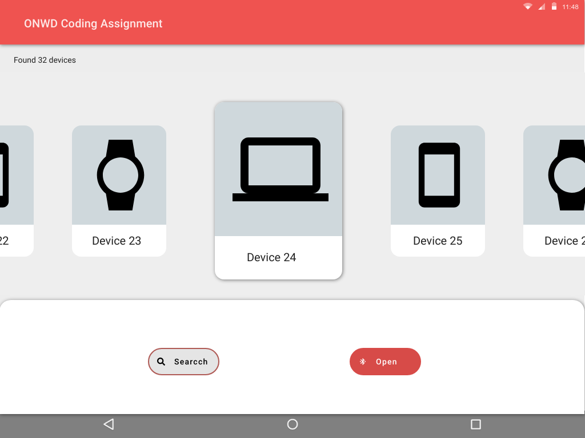

# ONWARD Coding Assignment

## Introduction
Thank you for taking the time to take on this assignment. In this assignment, you will find a base implementation of an Android App and some feature requests we would like you to implement.

### Feature requests
1. Search, pressing the search button starts a search
2. List results, show the results of the search
3. Open, selecting a device and pressing open navigates to the 'Device Details' view
4. Device Details, the 'Device Details' view should show the details of the previously selected device
5. Navigate back, navigating back to the first view, and the first view should show the search results and previously made selection

### Requirements
- Try to make the screens look as close as possible to the provided mock-ups
- Prove that the App is working correctly
- Refactoring is stimulated, make sure however that the functionality doesn't change
- When adding new code, please use Kotlin
- When modifying existing Java code, please keep it in Java

### Optional
If you have RxJava knowledge and would like to show it off, refactor parts where you think using RxJava would improve the code.

## Mock-ups
Below are the designs for both screens on a 9" Tablet.
Use the available clip arts/ icons from Android Studio when needed. 

### Search

### Device Details

### Improvment Application

The app work on my side, there is some improvements I will love to bring though :

- I choose a quite simple structure, the separation between logic and UI
  could be better with MVVM architecture : ViewModel, databinding,
  and Room to store found devices. (in case of future use and retain them).
  The use of NavigationFragment could improve the navigation between
  the fragments and to pass data.
  ViewModel would also retain data if there is screen orientation changed.

- The scale of the center recyclerview item could be done via the ItemDecoration
  Class or use animation scale.

- Adding the device icons directly in the DeviceFactory class would have been better
  and not proceed to the logic in Fragment.
  adding a parameter Icon in Device class, with getter/setter in Device & IDevice.

- Create Dimension file for textview would have optimize my layouts. 

UNIT TEST
- To prove that the app work, I began to setup a Unit Test but he's not complete.
- The test would be :
- Check nullability of the Search Fragment and MainActivity
- Check nullability of the views and the Device classes
- Perform Click on Search Button
- Assert the Device list is not empty and not null
- Perform Click on open Button
- Check nullability of the DeviceDetails Fragment
- Check nullability of the views
- Assert values have filled views
- Perform Click Close button and assert view destroy
- Assert Search Fragment is Resume

  

